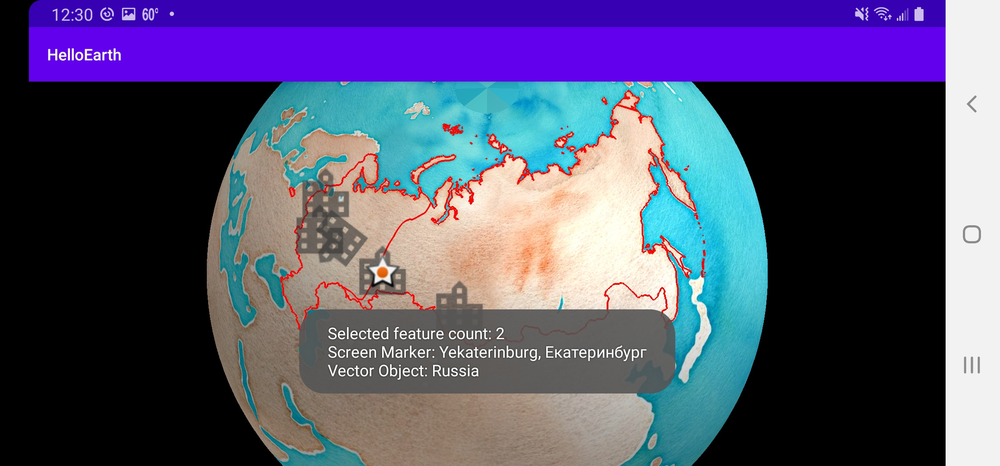

Screen marker selection is similar to [vector selection](vector-selection.html). Markers, however, are treated as an annotation to the map. Markers are added to the map to annotate a location with an icon, and this is done explicitly by creating a `ScreenMarker` object. Vector Objects, in contrast, are typically created by parsing vector formats like GeoJSON.

### Switch to the Marker Fragment

As before, activate the globe fragment with markers in `activity_main.xml`:

```xml
    <fragment
        android:id="@+id/fragment"
        android:name="com.mousebirdconsulting.helloearth.HelloMarkerFragment"
```

### Create User Object

We'll need to associate some data with each marker.  For this purpose, we create a class, `MarkerProperties`:

This is the main difference between marker selection and vector selection. A `VectorObject` has an attribute dictionary that is populated with data from the source vector data. Markers, however, are usually explicitly created. WhirlyGlobe understands this use case and lets you assign any `Object` you would like to `userObject`. When your marker is selected, you can then have a reference to your object.

```java
public class MarkerProperties {
    public String city;
    public String subject;
}
```

### Make Screen Marker Selectable

As with vector selection, we need to set the marker object to be selectable. In the `insertMarkers` method in [HelloMarkerFragment.json](https://github.com/mousebird/AndroidTutorialProject/blob/master/app/src/main/java/com/mousebirdconsulting/helloearth/HelloMarkerFragment.java), go through each `ScreenMarker` and make `marker.selectable = true;`, as well as creating and assigning a `MarkerProperties` object.

```java
private void insertMarkers() {
    ...
    // Moscow - Москва
    MarkerProperties properties = new MarkerProperties();
    properties.city = "Moscow";
    properties.subject = "Москва";
    ScreenMarker marker = new ScreenMarker();
    marker.loc = Point2d.FromDegrees(37.616667, 55.75); // Longitude, Latitude
    marker.image = icon;
    marker.size = markerSize;
    marker.selectable = true;
    marker.userObject = properties;
    markers.add(marker);
    ...
}
```

### Create Gesture Delegate Method

As explained in the [Vector Selection Tutorial](vector-selection.html), we create a `userDidSelect` delegate method.

```java
@Override
public void userDidSelect(GlobeController globeControl, SelectedObject[] selObjs,
                          Point2d loc, Point2d screenLoc) {
    String msg = "Selected feature count: " + selObjs.length;
    for (SelectedObject obj : selObjs) {
        // GeoJSON
        if (obj.selObj instanceof VectorObject) {
            VectorObject vectorObject = (VectorObject) obj.selObj;
            AttrDictionary attributes = vectorObject.getAttributes();
            String adminName = attributes.getString("ADMIN");
            msg += "\nVector Object: " + adminName;
        }
        // Screen Marker
        else if (obj.selObj instanceof ScreenMarker) {
            ScreenMarker screenMarker = (ScreenMarker) obj.selObj;
            MarkerProperties properties = (MarkerProperties) screenMarker.userObject;
            msg += "\nScreen Marker: " + properties.city + ", " + properties.subject;
        }
    }

    Toast.makeText(getActivity(), msg, Toast.LENGTH_LONG).show();
}
```

This method will be called whenver a vector object is selected.

### Set Fragment as Gesture Delegate

As before, again, we need to tell the controller to notify us by setting the gesture delegate:

```java
@Override
protected void controlHasStarted() {
    ...
    globeControl.gestureDelegate = this;
    ...
}
```

Now, when you tap on a marker, two geographic features are selected. That is because the marker is on top of the Russia GeoJSON polygon. When a user taps on a map or globe, all of the features that intersect with the tap are selected. You are then given an array of the selected objects from what you can do as you choose.


### Draw Marker as Selected

We might want to draw a new icon for a marker to show that it has been selected. For simplicity, we'll borrow a built-in drawable instead of creating our own for this example.

Create the following method in `HelloMarkerFragment`:

```java
public void addSelectedMarker(ScreenMarker screenMarker) {
    if (selectedMarkerComponent != null) {
        globeControl.removeObject(selectedMarkerComponent, BaseController.ThreadMode.ThreadAny);
    }
    MarkerInfo markerInfo = new MarkerInfo();
    markerInfo.setDrawPriority(Integer.MAX_VALUE);
    Bitmap icon = BitmapFactory.decodeResource(getActivity().getResources(), android.R.drawable.star_on);
    Point2d markerSize = new Point2d(100, 100);
    screenMarker.image = icon;
    screenMarker.size = markerSize;
    screenMarker.selectable = true;
    selectedMarkerComponent= globeControl.addScreenMarker(screenMarker, markerInfo, BaseController.ThreadMode.ThreadAny);
}
```

Also add a member to track the selection:

```java
ComponentObject selectedMarkerComponent;
```

And, finally, call the new `addSelectedMarker` method when we are handling a selected `ScreenMarker`:

```java
...
// Screen Marker
else if (obj.selObj instanceof ScreenMarker) {
    ScreenMarker screenMarker = (ScreenMarker) obj.selObj;
    MarkerProperties properties = (MarkerProperties) screenMarker.userObject;
    msg += "\nScreen Marker: " + properties.city + ", " + properties.subject;
    drawScreenMarkerAsSelected(screenMarker);
}
```



That's it, you now have the tools you need to select and get notified of selected screen markers in WhirlyGlobe-Maply!

---

*Tutorial by Nicholas Hallahan, Steve Gifford, Tim Sylvester.*

