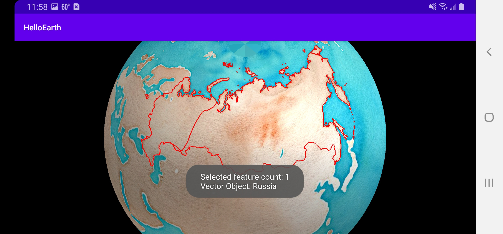

Sometimes it is important to be able to interact with the data on your map. On a [previous tutorial](vector-data.html), we added vector data to the map from GeoJSON. Though the user can see the country of Russia on the map, we might also need to be able to touch the polygon to pull up information about that geographic feature.

### Switch to GeoJSON Fragment

First, switch your layout back to `HelloGeoJsonFragment`:

```xml
...
   <fragment
        android:id="@+id/fragment"
        android:name="com.mousebirdconsulting.helloearth.HelloGeoJsonFragment"
...
```

### Make Vector Object Selectable

Vector selection in WhirlyGlobe--Maply is easy to enable. First, make sure that you have set your `VectorObject` to be selectable. In [GeoJsonHttpTask.java](https://github.com/mousebird/AndroidTutorialProject/blob/master/app/src/main/java/com/mousebirdconsulting/helloearth/GeoJsonHttpTask.java), call `object.selectable(true);`.

```java
@Override
protected void onPostExecute(String json) {
    VectorObject object = new VectorObject();
    if (object.fromGeoJSON(json)) {

        object.setSelectable(true);

        VectorInfo vectorInfo = new VectorInfo();
        vectorInfo.setColor(Color.RED);
        vectorInfo.setLineWidth(4.f);
        controller.addVector(object, vectorInfo, BaseController.ThreadMode.ThreadAny);
    }
}
```

### Create Gesture Delegate Method

The super class of `HelloMapFragment` is `GlobeMapFragment`. One of the methods defined is `userDidSelect`. This is a delegate method that you can override that is called whenever an object is selected. In [HelloGeoJsonFragment.java](https://github.com/mousebird/AndroidTutorialProject/blob/master/app/src/main/java/com/mousebirdconsulting/helloearth/HelloGeoJsonFragment.java), create the following method:

```java
@Override
public void userDidSelect(GlobeController globeControl, SelectedObject[] selObjs, Point2d loc, Point2d screenLoc) {
    super.userDidSelect(globeControl, selObjs, loc, screenLoc);

    String msg = "Selected feature count: " + selObjs.length;
    for (SelectedObject obj : selObjs) {
        // GeoJSON
        if (obj.selObj instanceof VectorObject) {
            VectorObject vectorObject = (VectorObject) obj.selObj;
            AttrDictionary attributes = vectorObject.getAttributes();
            String adminName = attributes.getString("ADMIN");
            msg += "\nVector Object: " + adminName;
        }
    }

    Toast.makeText(getActivity(), msg, Toast.LENGTH_LONG).show();
}
```

This method will be called whenver a vector object is selected.

There are a lot of things you can do when `userDidSelect` is fired. To keep things simple, we just create a `Toast` (popup) message that displays the administrative name from the original GeoJSON of the polygon that was selected.

### Set Fragment as Gesture Delegate

In order to call `userDidSelect`, the globe controller needs to know that your `HelloMapFragment` should be notified when a selection occurs. In the [`controlHasStarted`](https://github.com/mousebird/AndroidTutorialProject/blob/master/app/src/main/java/com/mousebirdconsulting/helloearth/HelloGeoJsonFragment.java) method, set:

```java
@Override
protected void controlHasStarted() {
    ...
    // Tell the controller that this object is the gesture delegate.
    globeControl.gestureDelegate = this;
    ...
}
```

It doesn't matter when you set this fragment as the delegate, as long as it happens before the user actually selects the vector. `controlHasStarted` is the most logical place for us to do this.



### Draw Vector as Selected

Now that we can programatically get a vector object that has been selected, we might want to redraw that vector on the map in a way that indicates that it has been selected. To do this, we take the selected vector object and re-add it to our map controller with a different color and higher draw priority.

Create the following method in [HelloGeoJsonFragment](https://github.com/mousebird/AndroidTutorialProject/blob/master/app/src/main/java/com/mousebirdconsulting/helloearth/HelloGeoJsonFragment.java):

```java
private void addSelectedObject(VectorObject vectorObject) {
    // remove any previously-selected object
    if (selectedComponentObject != null) {
        globeControl.removeObject(selectedComponentObject, BaseController.ThreadMode.ThreadAny);
    }

    // Re-add the object with different info
    VectorInfo vectorInfo = new VectorInfo();
    vectorInfo.setColor(Color.argb(255,255,140,0)); // Gold
    vectorInfo.setLineWidth(10.f);
    vectorInfo.setDrawPriority(Integer.MAX_VALUE); // Make sure it draws on top of unselected vector
    selectedComponentObject = globeControl.addVector(vectorObject, vectorInfo, BaseController.ThreadMode.ThreadAny);
}
```

This method is to be called in `userDidSelect` when we are handling a selected `VectorObject`:

```java
    ...
    drawVectorObjectAsSelected(vectorObject);
}
```

Lastly, make sure you have a class member `ComponentObject selectedComponentObject;`. Whenever a selection is made, we check to see if there was a previous selection and remove it from the map controller.

```java
    private ComponentObject selectedComponentObject;
```

Now, when a user taps on Russia, it should have a golden border instead of red.


---

*Tutorial by Nicholas Hallahan, Steve Gifford, Tim Sylvester.*

